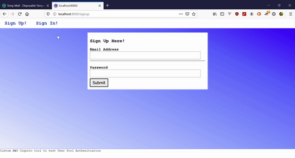

# Gatsby - Amplify starter pack
This project aims to provide a clear overview on how to use the Amplify Auth module in a React-Gatsby project

## Features
1. Register
2. Login
3. Logout
4. Profile shows user information from Amplify/Coginito user pools

## Setup this project
1. Clone the repository
2. ```npm install```
3. Set up a Cognito User Pool with an appropriate web client - This projet User Pool Settings:
  - users can use their email address as the username
  - verification type is "Link"
  - app client is no secret key
  - and added a custom domain (it is required if the verification is set to "Link")

4. create a ```.env.development``` file in the root directory with the following keys and values

|key|description|
|-|-|
|COGNITO_REGION|AWS region of the cognito user pool|
|COGNITO_USER_POOL_ID|AWS Cognito user pool ID|
|COGNITO_USER_POOL_WEB_CLIENT_ID|AWS Cognito user pool web client ID|

## Demo


